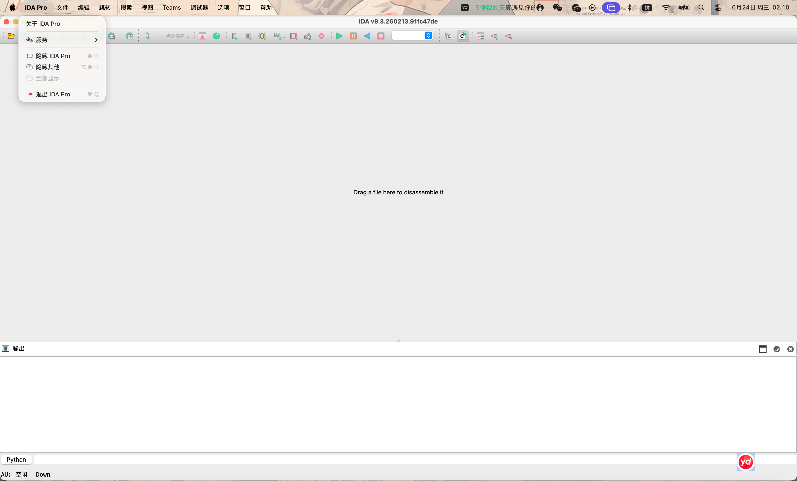
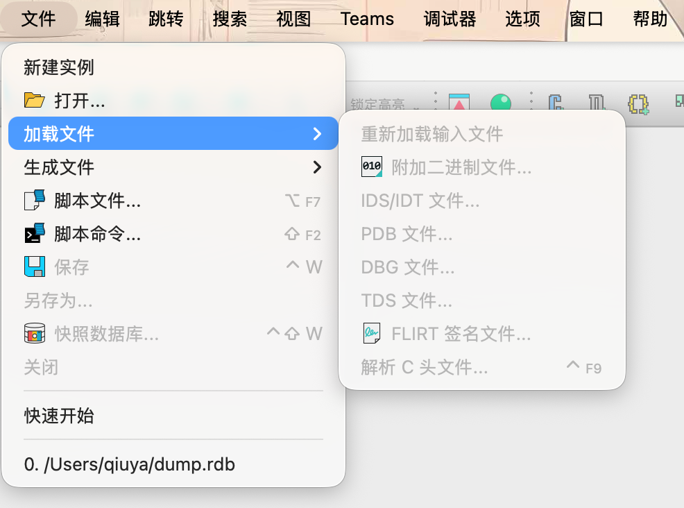
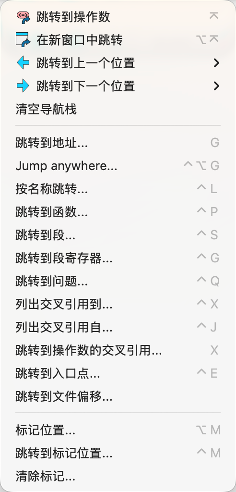
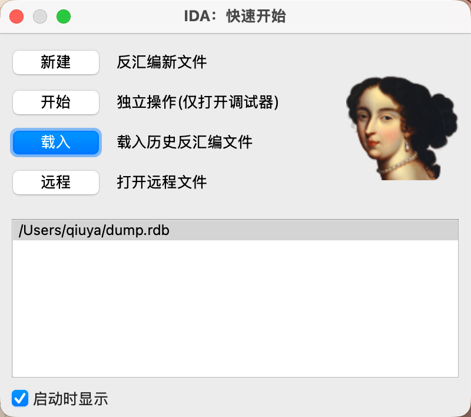
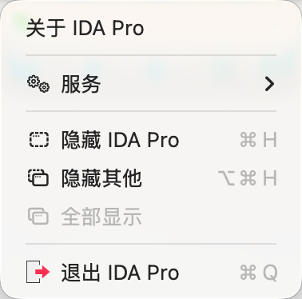

# IDA Professional 9.3 中文汉化（macOS / Apple Silicon）

> **版本 v1.0.0** · 支持 **IDA Pro / IDA Professional 9.3**（macOS / Apple Silicon · arm64 · Qt 6.8）

> 一个**不修改原版 IDA** 的界面汉化方案：用 `DYLD_INSERT_LIBRARIES` 往 IDA 进程注入一个
> 翻译库，运行时拦截 Qt6 的若干“设置界面文字”的函数，按词典把英文换成中文，再交还给 Qt。
> 双击一个壳 `.app` 即可启动「中文界面的官方原版 IDA」。

面向 **macOS / Apple Silicon（arm64）+ IDA Professional 9.3 + Qt 6.8**。

> ⚠️ **免责声明**：仅供学习与个人使用。IDA / IDA Pro 是 Hex-Rays SA 的产品与商标，本项目
> **不包含、不修改、不分发** IDA 本体，也**不涉及任何授权破解**，只在运行时注入一个翻译外壳。
> 请遵守 IDA 的许可协议。

---

## 截图

整窗概览（菜单栏全中文）：



| 文件菜单 | 跳转菜单 |
|---|---|
|  |  |

| 快速开始 | macOS 应用菜单 |
|---|---|
|  |  |

---

## 特性

- ✅ **不动原版**：壳只是用 `open --env` 把汉化库与词典作为环境变量、把官方 IDA 正常拉起；
  原版的文件、签名、二进制一字节不改。卸载＝把壳拖进废纸篓。
- ✅ **菜单 / 工具栏 / 对话框 / 选项页 / 状态栏 / 标签 / 复选框 / 选项卡** 等界面文字汉化。
- ✅ **对逆向友好**：只翻译真正的界面控件，**绝不触碰被分析的二进制内容**（见下「设计原则」）。
- ✅ **词典即改即生效**：`ida_lang.txt` 是运行时读取的，改完重启 IDA 就行，**不用重新编译**。
- ✅ 纯 `DYLD_INTERPOSE` 注入，Qt 符号全部对真二进制核对过，arm64 原生。

## 设计原则：不碰被分析的二进制内容

汉化只走**控件级 hook**——`translate` 以及各 `setText / setTitle / setWindowTitle / setToolTip /
addTab / QPushButton·QCheckBox·QLabel 的带文本构造函数`……这些**只作用于真正的界面控件**，
天然安全。

刻意**不**走 `QString::fromUtf8` 之类的“广撒网”路径：它会构造一切字符串（包括函数名、字符串
窗口里**被逆向二进制的真实内容**），在那里翻译会把分析对象里真实出现的英文也误改成中文、污染
逆向结果。**代价**：极少数仅由 `fromUtf8` 构建、又不经任何控件方法的界面文字会保持英文（例如
主窗口空白处的拖放提示 “Drag a file here to disassemble it”）——对一个逆向工具来说，这点取舍
是值得的。

---

## 安装与使用

### 方式一：直接用预编译壳（最快）
1. 把官方 **IDA Professional 9.3** 装在 `/Applications/IDA Professional 9.3.app`。
2. 双击本目录下的 **`IDA Professional 9.3 中文.app`**。完事。
3. 可把壳拖进 `/Applications` 或 Dock，随处可放（壳会自动定位自己的资源）。

> 仓库默认 **不提交**预编译壳与图标（见 `.gitignore`，避免分发 Hex-Rays 的图标/二进制）。
> 克隆仓库后请用下面的 `build.sh` 现场生成。

### 方式二：从源码构建
```bash
# 需要本机已装官方 IDA 9.3 + Xcode 命令行工具(clang)
./build.sh            # 生成「IDA Professional 9.3 中文.app」
# 官方 IDA 不在默认位置时：
IDA_APP="/path/to/IDA Professional 9.3.app" ./build.sh
```

> 注：壳放在哪个目录都行。即使目录名里含**冒号**（如本仓库名 `(macOS:Apple_Silicon)`），
> 启动器也会自动把 hook 库复制到无冒号的临时路径再注入——因为 `DYLD_INSERT_LIBRARIES`
> 以冒号分隔路径，路径里的冒号会被劈断（这是个隐蔽的坑，已在启动器里处理掉）。


---

## 工作原理

一条注入的生命周期：

```
双击壳 .app
  → 壳里的 Mach-O 启动器(ida-zh-launcher)
  → exec: /usr/bin/open -n --env DYLD_INSERT_LIBRARIES=<hook.dylib> --env IDA_LANG=<dict> -a <官方IDA>
  → LaunchServices 正常拉起官方 IDA（环境变量随之带入）
  → dyld 加载 ida_lang_hook.dylib（它把 IDA 的 Qt 三框架声明为依赖，确保先于 interpose 绑定加载好）
  → __DATA,__interpose 段生效：dyld 把对这些 Qt 函数的调用改派给我们的替换函数
  → IDA 每次设置界面文字 → 替换函数读出原文 → 查词典 → 用 QString::fromUtf8 造中文 → 交还 Qt
```

拦截的控件级符号（`QT` 是 IDA 自带 Qt 的自定义命名空间）：

- `QCoreApplication::translate`、`QTranslator::translate`（`.ui`/`tr()` 路径）
- `QAction/QLabel/QAbstractButton/QMessageBox::setText`、`QMenu/QGroupBox::setTitle`、
  `QWidget::setWindowTitle/setToolTip`、`QAction::setToolTip`、`QTabWidget::setTabText`、
  `QStatusBar::showMessage`、`QLineEdit::setPlaceholderText`
- `QTabWidget::addTab`、`QTabBar::addTab`、`QPushButton/QCheckBox/QLabel` 的**带文本构造函数**

> 注：源码里还实现了 `QString::fromUtf8/fromLatin1` 的“广撒网”兜底，但**默认关闭**（见上「设计
> 原则」——开启会波及被分析的二进制内容，对逆向不利），故不在拦截清单内、也不作为功能提供。
  （这些是“构造时就带文本、绕过 setText”的路径，多为 `QStringLiteral`）

### 为什么这么做 —— macOS 上踩过的坑（对做 Qt 注入/逆向的人很有参考价值）

1. **必须用 `DYLD_INTERPOSE`，不能靠“导出同名符号”。** macOS 默认 two-level namespace，
   导出同名符号并不会替换对 Qt 的调用（这点和 Linux 的 `LD_PRELOAD` 完全不同）；要把
   `{替换函数, 原始函数}` 成对写进 `__DATA,__interpose` 段。

2. **符号名下划线规则相反。** IDA 的 Qt 用自定义命名空间 `QT`，符号形如
   `__ZN2QT16QCoreApplication9translate...`。`asm()` 标签写**两个**前导下划线（逐字 Mach-O 名），
   而 `dlsym` 要写**一个**（dlsym 会自动补一个）。

3. **arm64 调用约定：按值返回大结构体走 x8。** `QString`（Qt6 是 24 字节）按值返回时，返回槽
   地址由调用方放在 **x8**，参数从 x0 起。把替换函数声明成“按值返回 QString”即可让编译器自动
   用 x8——不能照搬 Linux x86-64 “把返回指针当第一个参数”的写法（那会整体错位）。

4. **`QString::fromUtf8(QByteArrayView)` 的入参顺序。** Qt6 的 `QByteArrayView` 是
   `{ qsizetype m_size; const char* m_data; }`——**size 在前**！按值传 → x0=size、x1=data。
   写反了会把字符串长度当指针解引用而段错误（实测崩溃地址正好等于字符串长度）。

5. **加载顺序：注入库要正式链接 Qt 框架。** 注入库比 IDA 的 Qt 更早加载，而 `__interpose`
   段里取原始 Qt 函数地址是“加载期就要绑定”的。解决：让注入库**链接** QtCore/QtGui/QtWidgets
   作为依赖，dyld 加载注入库时会先把它们加载好。

6. **静态初始化顺序：词典用函数内静态。** `__attribute__((constructor))` 可能早于命名空间级
   静态对象的构造而运行，往未构造的容器插入会触发 `std::__next_prime` 溢出 → SIGABRT。改成
   **Meyers 单例**（函数内静态）即保证“首次用时才构造、且构造先于使用”。

7. **启动方式：必须 `open --env`，且壳主程序用编译型二进制。** 直接运行裸二进制
   `Contents/MacOS/ida` 会触发 IDA 经 LaunchServices **重新拉起自己、剥掉所有 `DYLD_*`** →
   注入失效。要用 `open --env` 把 IDA 当正常 app 拉起。而壳 `.app` 的可执行体若用 shell 脚本
   会被 LaunchServices 拒绝（报 -10669），改用编译型 Mach-O 最稳。

---

## 词典：格式与扩展

`ida_lang.txt`，每行一条，UTF-8 / CRLF：
```
L"原文",L"译文",
```
- 支持 C 转义：`\"`（内部引号）、`\\`、`\n`、`\t`、`\r`。
- Qt 助记符写成 **`译文(&X)`** 形式（`X` 用原文里 `&` 后的字母）。例：`"&Font"` → `"字体(&F)"`。
- `原文==译文` 的条目表示“有意保留英文”（品牌名/调用约定/快捷键名等）。

**补翻译**：直接往 `ida_lang.txt` 加行，存盘后重启 IDA 即可，**无需重新编译**（只要把更新后的
`ida_lang.txt` 覆盖进 `…app/Contents/Resources/`，或重跑 `build.sh`）。

**找未翻译的原文**：用 `IDA_ZH_DEBUG=1` 启动，退出时未命中的原文会写到
`/tmp/ida_missing_translations_mac.txt`，挑出来填好译文追加进词典即可。

---

## 已知限制（注入方式的固有边界，非遗漏）

- **macOS 系统注入项**：编辑菜单的 `AutoFill / Start Dictation / Emoji & Symbols`、应用菜单
  里 `服务` 子菜单的 `No Services Apply / Services Settings…`、系统文件面板的 `Cancel/Open`
  等，都是 AppKit/系统加的，不归 Qt 管 → 翻不了。
- **极少数 `fromUtf8`-only 文字**：不经任何控件方法、只由 `fromUtf8` 构建的零星文字（如主窗口
  的拖放提示、`Jump anywhere…` 等）在保守模式下保持英文（见上「设计原则」，这是刻意取舍）。

---

## 目录结构

```
.
├── README.md
├── LICENSE                 MIT（含原项目署名）
├── build.sh                从源码构建 .app（链接本机 IDA 的 Qt 框架与图标）
├── ida_lang.txt            中英词典（约 2350 条；改即生效，免编译）
├── src/
│   ├── ida_zh_hook_mac.cpp 注入库：21 个 Qt 符号拦截 + 词典查换 + 两种模式
│   └── ida-zh-launcher.c   壳的 Mach-O 启动器（内部 open --env 拉起官方 IDA）
└── docs/                   截图
```

---

## 致谢

- **[GodKeawa/IDA-Pro-zh_cn](https://github.com/GodKeawa/IDA-Pro-zh_cn)**（作者 fr0stb1rd，MIT）：
  本项目的 **词典 `ida_lang.txt`** 与“拦截 Qt 翻译函数做 UI 汉化”的思路衍生自该 Arch Linux 项目。
  本项目是把它**移植到 macOS / Apple Silicon**：从 Linux 的 `LD_PRELOAD` + Qt5 + x86-64，
  重写为 macOS 的 `DYLD_INTERPOSE` + Qt6 + arm64，并补充了大量控件级 hook、对逆向友好的
  “不碰二进制内容”设计，以及一系列 ABI / 加载顺序的修正。
- IDA / Hex-Rays：被汉化的对象，版权归 Hex-Rays SA。

## 许可

本项目（macOS 移植部分）以 **MIT** 开源，并保留原项目的 MIT 版权声明。详见 [LICENSE](LICENSE)。
